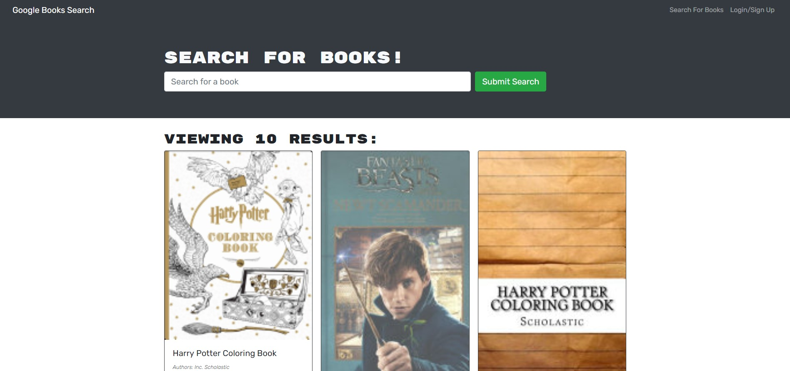

# Book-Search

This is an application that allows you to search for books online and saved them to list of your saved books for later review as well as remove the books you no longer wish to track. This site was built using MERN - MongoDB, Express, React and Node. 

# Installation

Clone the repository from GitHub and open using Visual Studio Code.

# Usage 

[Deployed Site]()

# Credits

Made by [Shannon Dukes]

[Express](http://expressjs.com/)

[React](https://reactjs.org/)

[MongoDB](https://www.mongodb.com/)

[Mongoose](https://mongoosejs.com/)

[Apollo](https://www.apollographql.com/)

[GraphQL](https://graphql.org/)

[Node.js](https://nodejs.org/en/)

[Heroku](https://www.heroku.com/home)

# Questions

[Contact Me](mrs.knit.wit.dukes@gmail.com)

[GitHub](https://github.com/ShannonDukes)